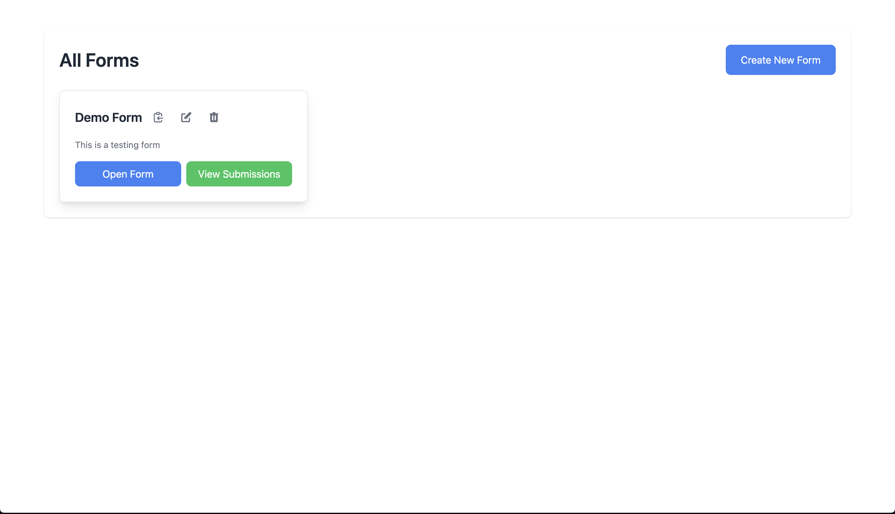
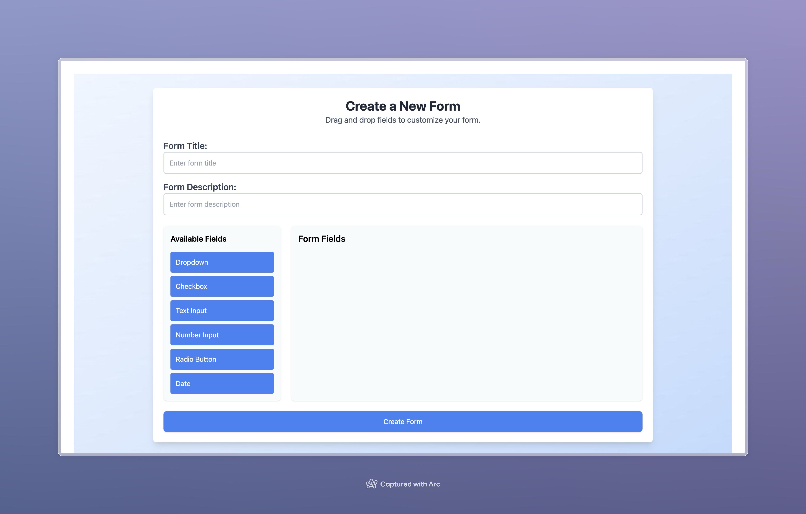
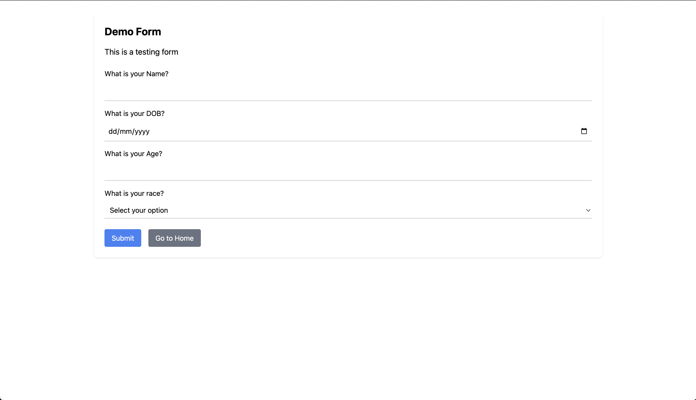
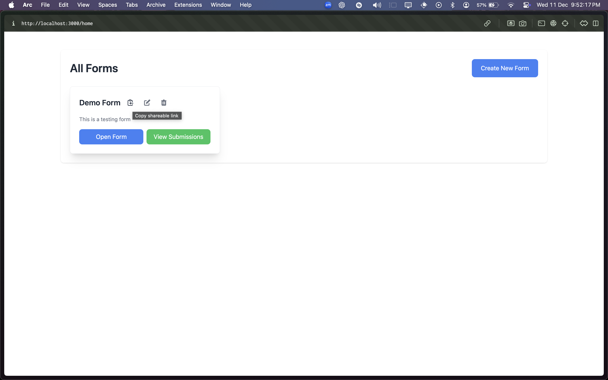
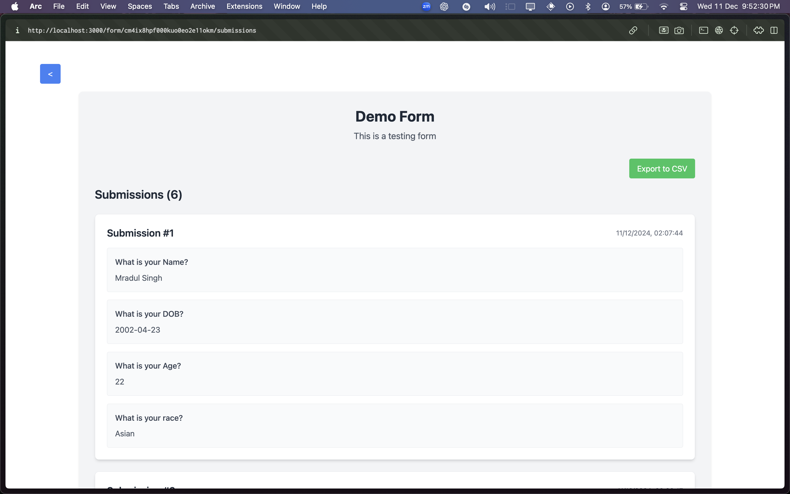

**Full Stack Form Builder Application**
This project provides a complete solution for creating, managing, and submitting dynamic forms. It includes:
DEMO:-
**HOME PAGE**

**CREATE A NEW FORM**

**FILL A FORM**

**COPY LINK**

**VIEW SUBMISSION FOR FORM**

Backend: A RESTful API built with Node.js, Express, Prisma, and PostgreSQL.
Frontend: A React-based dynamic form builder and submission viewer.
Features
Backend Features:
API for creating, managing, and submitting forms.
JWT-based authentication for secure operations.
Supports exporting form submissions as CSV.
Frontend Features:
Drag-and-drop form builder.
Real-time form customization.
Responsive design for managing and submitting forms.
CSV export from the submission viewer.
Requirements
General:
Node.js: Version 16 or above.
PostgreSQL: A running PostgreSQL instance.
React: React 18 or above for the frontend.
Optional:
Docker: For containerized deployment.
Local Setup
Backend Setup
Without Docker:
Clone the repository:

git clone <repository-url>
cd <project-folder>/backend
Install dependencies:

npm install
Create a .env file in the backend directory:

env

DATABASE_URL=postgresql://<username>:<password>@<host>:<port>/<database>?schema=public
JWT_SECRET=your_secret_key
Run Prisma commands:

npx prisma generate
npx prisma migrate dev --name init
Start the server:

npm start
Access the API:

arduino

http://localhost:5001
With Docker:
Navigate to the backend folder:

cd <project-folder>/backend
Update environment variables in docker-compose.yml if necessary.

Start the containers:

docker-compose up --build
Access the API:

arduino

http://localhost:5001
Frontend Setup
Navigate to the frontend folder:

cd <project-folder>/frontend
Install dependencies:

npm install
Create a .env file in the frontend directory:

env

REACT_APP_API_URL=http://localhost:5001
Start the development server:

npm start
Access the application:

arduino

http://localhost:3000
Deployment Instructions
Backend Deployment (Render):
Create a new service on Render:

Choose Node.js.
Set up environment variables (DATABASE_URL and JWT_SECRET) in the Render dashboard.
Add the build and start commands in package.json:

json

"scripts": {
  "build": "npx prisma generate && npx prisma migrate deploy",
  "start": "node index.js"
}
Deploy the backend using Render.

Frontend Deployment (Netlify):
Create a new site on Netlify:

Link the repository.
Set the build command to:

npm run build
Set the publish directory to:

build
Add environment variables:

REACT_APP_API_URL pointing to the deployed backend URL.
Deploy the frontend.

API Documentation
Swagger UI
If integrated, access it at:

http://localhost:5001/api-docs
Postman Documentation
Import the provided Postman collection (postman_collection.json).
Set the BASE_URL to the deployed backend URL or http://localhost:5001 for local use.
Design Overview
Design Decisions
Backend:

Express.js: Lightweight and flexible for RESTful APIs.
Prisma: Simplified ORM for managing relational data.
PostgreSQL: Relational database to handle complex relationships.
JWT Authentication: Secure API endpoints.
Frontend:

React: Component-based architecture for dynamic user interfaces.
Tailwind CSS: For responsive and modern styling.
React DnD: For drag-and-drop functionality in the form builder.
Database Schema
Form Table

id, title, description, uuid, createdAt, updatedAt.
Field Table

id, formId (FK), type, label, options.
Submission Table

id, formId (FK), responses (JSON), submittedAt.
Authentication Flow
JWT Token Issuance: Secure user login.
Token Validation: Middleware ensures only authenticated requests.
Exporting Submissions as CSV
Submissions can be exported in CSV format:

Frontend: The submission viewer includes an "Export CSV" button.
Backend: Use the /api/forms/:id/submissions/export endpoint.
Contributing
Fork the repository.
Create a branch for your feature.
Submit a pull request.
