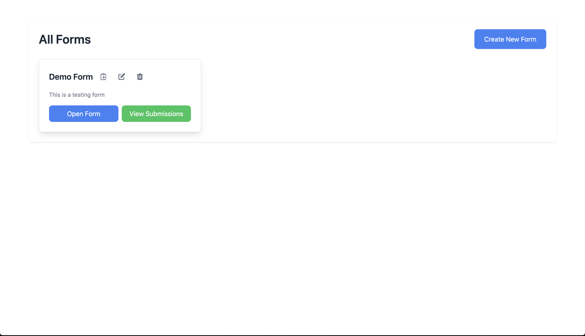
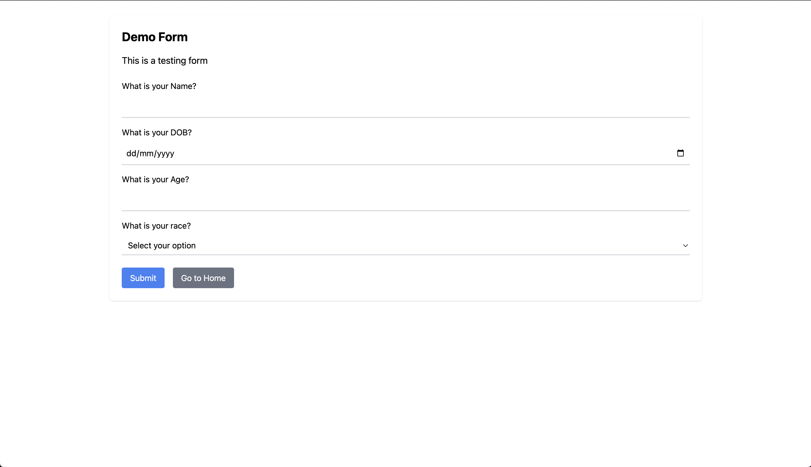
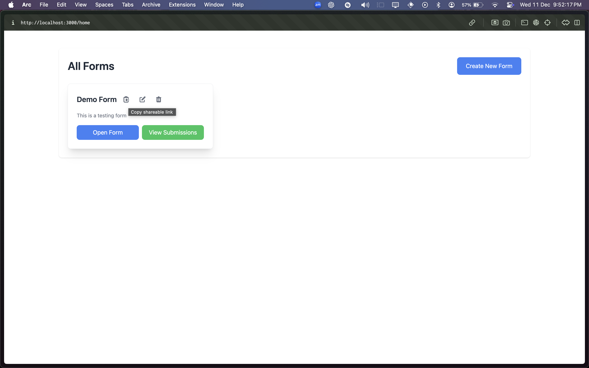
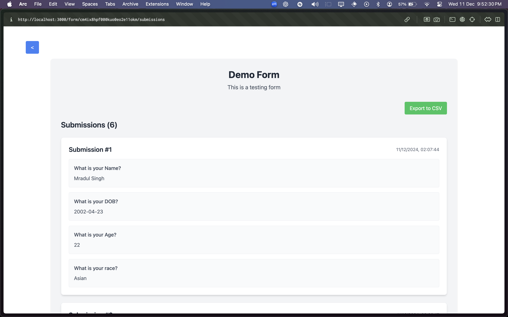

# Full Stack Form Builder Application

This project provides a complete solution for creating, managing, and submitting dynamic forms.

---

## Demo

### Home Page



### **CREATE A NEW FORM**



### Fill a Form



### Copy Link



### View Submission for Form


---

## Features

### Backend Features:

- RESTful API built with Node.js, Express, Prisma, and PostgreSQL.
- JWT-based authentication for secure operations.
- Export form submissions as CSV.

### Frontend Features:

- Drag-and-drop form builder.
- Real-time form customization.
- Responsive design for managing and submitting forms.
- CSV export from the submission viewer.

---

## Requirements

### General:

- **Node.js**: Version 16 or above.
- **PostgreSQL**: A running PostgreSQL instance.
- **React**: React 18 or above for the frontend.

### Optional:

- **Docker**: For containerized deployment.

---

## Local Setup

### Backend Setup

#### Without Docker:

1. Clone the repository:

   ```bash
   git clone <repository-url>
   cd <project-folder>/backend
   ```

2. Install dependencies:

   ```bash
   npm install
   ```

3. Create a `.env` file in the backend directory:

   ```env
   DATABASE_URL=postgresql://<username>:<password>@<host>:<port>/<database>?schema=public
   JWT_SECRET=your_secret_key
   ```

4. Run Prisma commands:

   ```bash
   npx prisma generate
   npx prisma migrate dev --name init
   ```

5. Start the server:

   ```bash
   npm start
   ```

6. Access the API at:

   ```
   http://localhost:5001
   ```

#### With Docker:

1. Navigate to the backend folder:

   ```bash
   cd <project-folder>/backend
   ```

2. Update environment variables in `docker-compose.yml` if necessary.

3. Start the containers:

   ```bash
   docker-compose up --build
   ```

4. Access the API at:

   ```
   http://localhost:5001
   ```

### Frontend Setup

1. Navigate to the frontend folder:

   ```bash
   cd <project-folder>/frontend
   ```

2. Install dependencies:

   ```bash
   npm install
   ```

3. Create a `.env` file in the frontend directory:

   ```env
   REACT_APP_API_URL=http://localhost:5001
   ```

4. Start the development server:

   ```bash
   npm start
   ```

5. Access the application at:

   ```
   http://localhost:3000
   ```

---

## Deployment Instructions

### Backend Deployment (Render):

1. Create a new service on Render:

   - Choose **Node.js**.
   - Set up environment variables (`DATABASE_URL` and `JWT_SECRET`) in the Render dashboard.

2. Add the build and start commands in `package.json`:

   ```json
   "scripts": {
     "build": "npx prisma generate && npx prisma migrate deploy",
     "start": "node index.js"
   }
   ```

3. Deploy the backend using Render.

### Frontend Deployment (Netlify):

1. Create a new site on Netlify:

   - Link the repository.

2. Set the build command to:

   ```bash
   npm run build
   ```

3. Set the publish directory to:

   ```bash
   build
   ```

4. Add environment variables:

   ```env
   REACT_APP_API_URL=<deployed-backend-url>
   ```

5. Deploy the frontend.

---

## API Documentation

### Swagger UI

If integrated, access it at:

```
http://localhost:5001/api-docs
```

### Postman Documentation

1. Import the provided Postman collection (`postman_collection.json`).
2. Set the `BASE_URL` to the deployed backend URL or `http://localhost:5001` for local use.

---

## Design Overview

### Design Decisions

#### Backend:

- **Express.js**: Lightweight and flexible for RESTful APIs.
- **Prisma**: Simplified ORM for managing relational data.
- **PostgreSQL**: Relational database to handle complex relationships.
- **JWT Authentication**: Secure API endpoints.

#### Frontend:

- **React**: Component-based architecture for dynamic user interfaces.
- **Tailwind CSS**: For responsive and modern styling.
- **React DnD**: For drag-and-drop functionality in the form builder.

### Database Schema

#### Form Table:

- `id`, `title`, `description`, `uuid`, `createdAt`, `updatedAt`

#### Field Table:

- `id`, `formId` (FK), `type`, `label`, `options`

#### Submission Table:

- `id`, `formId` (FK), `responses` (JSON), `submittedAt`

---

## Authentication Flow

1. **JWT Token Issuance**: Secure user login.
2. **Token Validation**: Middleware ensures only authenticated requests.

---

## Exporting Submissions as CSV

- **Frontend**: The submission viewer includes an "Export CSV" button.
- **Backend**: Use the `/api/forms/:id/submissions/export` endpoint.

---

## Contributing

1. Fork the repository.
2. Create a branch for your feature.
3. Submit a pull request.

